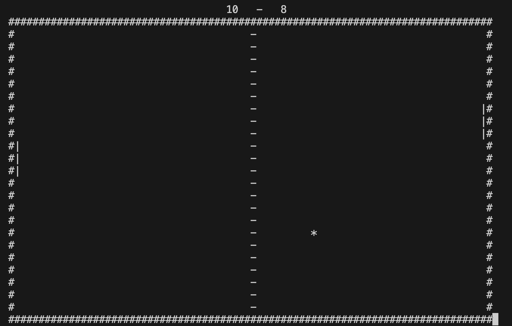

<h1>Welcome to ping pong!</h1>
#It's a simple ping pong CLI game
#To run it just go to ./src directory and "make" interactive target from Makefile
#Usage:
# hold "a" key to move left racket to Top
# hold "z" key to move left racket to Bottom
# hold "k" key to move right racket to Top
# hold "m" key to move right racket to Bottom
</img>